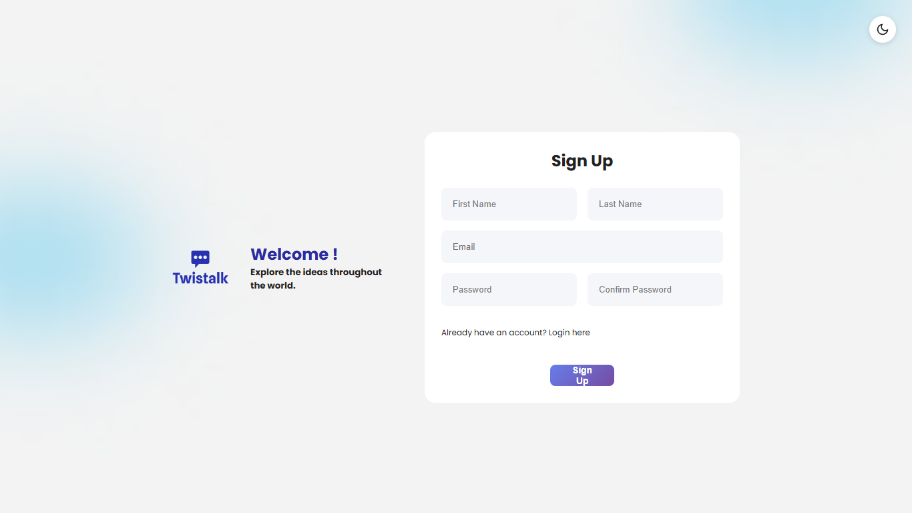
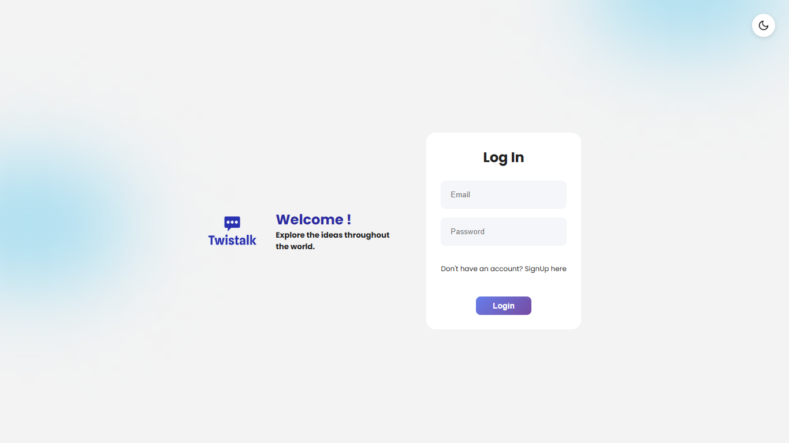
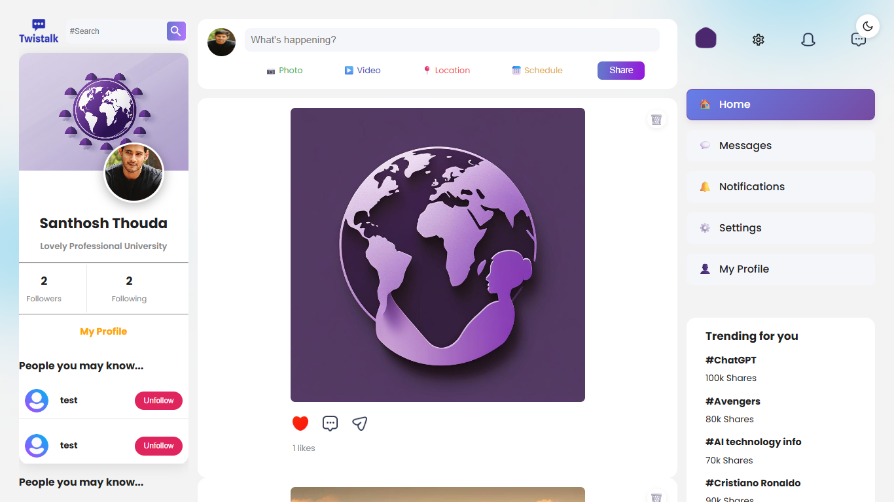
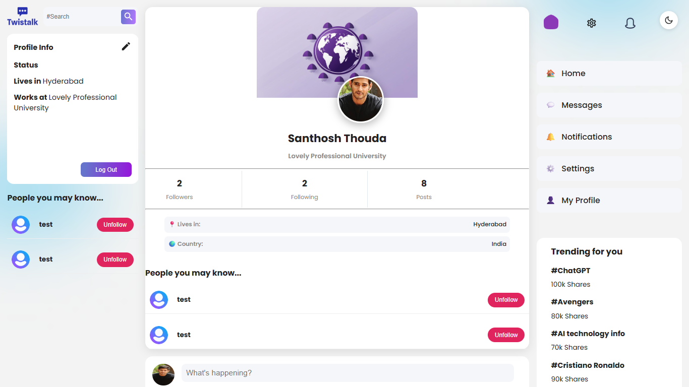
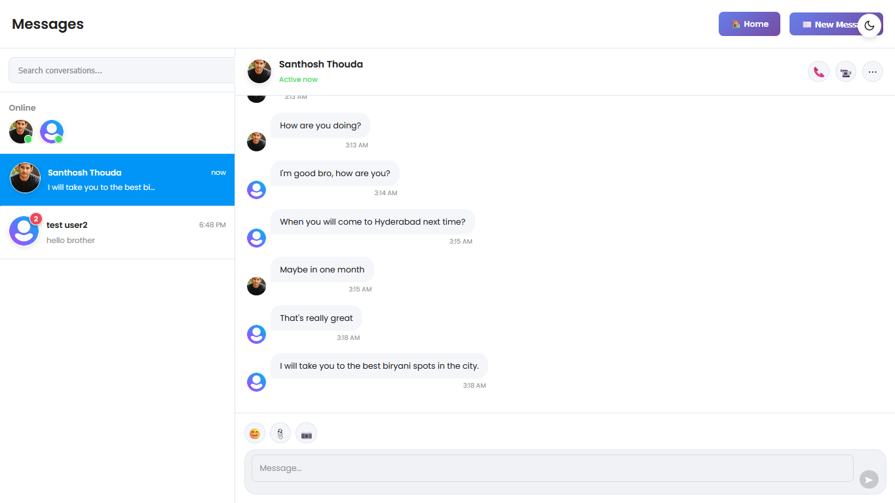

# Twistalk - Social Media Web App

A modern, full-stack social media web application 🌐 built with the **MERN stack 🖥️** and **REST API 🚀**. Twistalk is a comprehensive social media platform where users can share posts, like/unlike content, follow/unfollow users, and engage with a vibrant community.

## 🖥️ Tech Stack

### **Frontend:**
- **React.js** - User interface library
- **Material-UI** - Component library
- **CSS3** - Styling
- **React Router DOM** - Client-side routing
- **Redux** - State management

### **Backend:**
- **Node.js** - Runtime environment
- **Express.js** - Web framework
- **MongoDB** - NoSQL database
- **REST API** - API architecture
- **JWT Authentication** - Secure authentication

## 🚀 Features

### **User Authentication**
- ✅ User registration and signup
- ✅ Secure login with JWT tokens
- ✅ Password protection

### **Social Features**
- ✅ Create and share posts with text captions
- ✅ Like/unlike posts with real-time updates
- ✅ Follow/unfollow other users
- ✅ View follower/following counts
- ✅ Timeline with posts from followed users
- ✅ User profile management

### **Content Management**
- ✅ Image upload and sharing
- ✅ Post creation with captions
- ✅ Real-time post interactions
- ✅ Profile picture and cover photo updates

### **User Experience**
- ✅ Responsive design
- ✅ Real-time notifications
- ✅ User search functionality
- ✅ Profile editing capabilities

## 📸 Screenshots

### **Authentication Pages**

#### Sign Up Page
*User registration interface with form validation*




#### Login Page
*Secure login page with JWT authentication*



### **Main Application**

#### Home Feed
*Main timeline showing posts from followed users*



#### Post Sharing
*Interface for creating and sharing new posts*

#### Timeline View
*Chronological view of all posts and interactions*

### **User Profiles**



#### Profile Page
*User profile with posts, followers, and following*

#### Profile Editing
*Interface for updating user information and settings*

#### Profile Views
*Different views of user profiles and statistics*

#### Chats, Messages
*Main chat application features messaging, chats, new chats*




## 🛠️ Prerequisites

Before running this application, make sure you have the following installed:

- **Node.js** (v14 or higher)
- **MongoDB** (local installation or MongoDB Atlas)
- **Git** (for cloning the repository)
- **VS Code** or any code editor

## 📦 Installation & Setup

### 1. **Clone the Repository**
```bash
git clone <repository-url>
cd Social-Media-Web-App-Mern-Stack-
```

### 2. **Backend Setup**
```bash
# Navigate to server directory
cd Server

# Install dependencies
npm install

# Create a .env file with your MongoDB connection string
# Example: MONGODB_URI=mongodb://localhost:27017/twistalk

# Start the backend server
npm start
# or
nodemon
```

### 3. **Frontend Setup**
```bash
# Navigate to client directory
cd client

# Install dependencies
npm install

# Start the React development server
npm start
```

### 4. **Database Setup**
- Ensure MongoDB is running on your system
- Or use MongoDB Atlas (cloud database)
- Update the connection string in your backend `.env` file

## 🌐 Access the Application

- **Frontend**: http://localhost:3000
- **Backend API**: http://localhost:5000

## 🔧 Environment Variables

Create a `.env` file in the `Server` directory with the following variables:

```env
MONGODB_URI=your_mongodb_connection_string
JWT_SECRET=your_jwt_secret_key
PORT=5000
```

## 📁 Project Structure

```
Social-Media-Web-App-Mern-Stack-/
├── client/                 # Frontend React application
│   ├── public/            # Static files
│   ├── src/               # Source code
│   │   ├── Components/    # React components
│   │   ├── Pages/         # Page components
│   │   ├── api/           # API requests
│   │   ├── reducers/      # Redux reducers
│   │   └── store/         # Redux store
│   └── package.json
├── Server/                # Backend Node.js application
│   ├── Controllers/       # Route controllers
│   ├── Models/           # MongoDB models
│   ├── Routes/           # API routes
│   ├── Middleware/       # Custom middleware
│   └── package.json
└── README.md
```

## 🤝 Contributing

1. Fork the repository
2. Create a feature branch (`git checkout -b feature/AmazingFeature`)
3. Commit your changes (`git commit -m 'Add some AmazingFeature'`)
4. Push to the branch (`git push origin feature/AmazingFeature`)
5. Open a Pull Request

## 📝 License

This project is licensed under the MIT License - see the [LICENSE](LICENSE) file for details.

## 👨‍💻 Author

**Santhosh** - [GitHub Profile](https://github.com/santhosh-thouda)

## 🙏 Acknowledgments

- React.js community
- Material-UI team
- MongoDB documentation
- Express.js framework

---

**Made with ❤️ using the MERN Stack**
